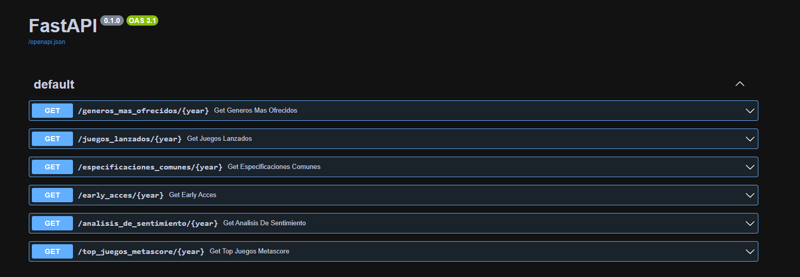
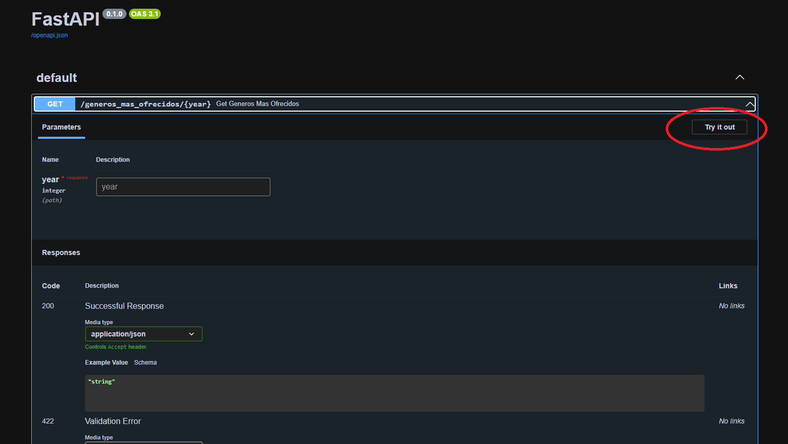
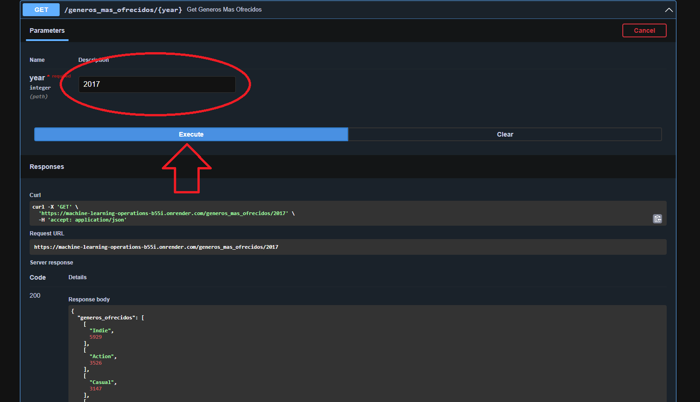
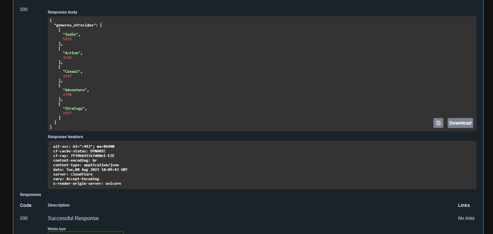

# Data Engineering and Machine-Learning-Operations

Steam Games Repository

## Descripción

Este proyecto se enfoca en el tratamiento de un Dataset de vvideojuegos y el despliegue de distintos endpoints, incluyendo un modelo de recomendación de predicción de precios.

## Características principales

- **FastAPI**: Un framework de desarrollo web de alto rendimiento para construir los endpoints del proyecto ([enlace](https://fastapi.tiangolo.com)).
- **Render**: Una plataforma de alojamiento y despliegue de aplicaciones web, para implementar y alojar el proyecto ([enlace](https://render.com)).
- **Datasets**: Se hace uso de los Datasets disponibles en el siguiente enlace: [Datasets](https://drive.google.com/drive/folders/1HqBG2-sUkz_R3h1dZU5F2uAzpRn7BSpj) para el análisis y entrenamiento del modelo de predicciones de precios de videojuegos.
- **Diccionario de datos**: El diccionario de datos utilizado se encuentra disponible en el siguiente enlace: [Diccionario de datos](https://docs.google.com/spreadsheets/d/1-t9HLzLHIGXvliq56UE_gMaWBVTPfrlTf2D9uAtLGrk/edit#gid=0) y proporciona información sobre las variables y su significado en el Dataset **steam_games**.

## Requisitos

- Tener Python 3.x instalado en tu sistema.
- Ejecutar el siguiente comando en la terminal para instalar las bibliotecas requeridas:

  ```bash
  pip install -r requirements.txt
Asegúrate de estar ubicado en el directorio del proyecto donde se encuentra el archivo **requirements.txt**

Este comando instalará automáticamente todas las bibliotecas necesarias en tu entorno virtual.

Si aún no tienes Python instalado, puedes descargarlo e instalarlo desde el sitio oficial de Python: https://www.python.org.

## Guía de Uso de las APIs

A continuación se detallan las diferentes APIs disponibles en el proyecto y cómo utilizarlas.

### API: `generos_mas_ofrecidos`

Esta API devuelve una lista con los 5 géneros más ofrecidos en orden correspondiente según el año.

- **URL**: `https://machine-learning-operations.onrender.com/generos_mas_ofrecidos/{year}`
- **Método**: GET
- **Parámetros**:
  - `year`: El año a partir del cual obtendrá los géneros más ofrecidos.
- **Ejemplo de uso**: `https://machine-learning-operations.onrender.com/generos_mas_ofrecidos/2017`

### API: `juegos_lanzados`

Esta API devuelve una lista de los juegos lanzados en un año determinado.

- **URL**: `https://machine-learning-operations.onrender.com/juegos_lanzados/{year}`
- **Método**: GET
- **Parámetros**:
  - `year`: El año a partir del cual obtendrás la lista de juegos que se lanzaron.
- **Ejemplo de uso**: `https://machine-learning-operations.onrender.com/juegos_lanzados/2016`

### API: `especificaciones_comunes`

Esta API devuelve una lista con las 5 especificaciones que más se repiten en determinado año en el orden correspondiente.

- **URL**: `https://machine-learning-operations.onrender.com/especificaciones_comunes/{year}`
- **Método**: GET
- **Parámetros**:
  - `year`: El año a partir del cual obtendrás la lista de especificaciones.
- **Ejemplo de uso**: `https://machine-learning-operations.onrender.com/especificaciones_comunes/2014`

### API: `early_acces`

Esta API devuelve la cantidad de videojuegos lanzados en determinado año con early acces.

- **URL**: `https://machine-learning-operations.onrender.com/early_access/{year}`
- **Método**: GET
- **Parámetros**:
  - `year`: El año a partir del cual obtendrás los videojuegos que se hayan lanzado con early acces.
- **Ejemplo de uso**: `https://machine-learning-operations.onrender.com/early_access/2015`

### API: `analisis_de_sentimiento`

Esta API devuelve una lista con la cantidad de registros que se encuentren categorizados con un análisis de sentimiento según el año.

- **URL**: `https://machine-learning-operations.onrender.com/analisis_de_sentimiento/{year}`
- **Método**: GET
- **Parámetros**:
  - `year`: El año a partir del cual obtendrás la lista de registros con un analisis de sentimiento.
- **Ejemplo de uso**: `https://machine-learning-operations.onrender.com/analisis_de_sentimiento/2016`

### API: `top_juegos_metascore`

Esta API devuelve un Top 5 de videojuegos según el año con mayor metascore

- **URL**: `https://machine-learning-operations.onrender.com/top_juegos_metascore/{year}`
- **Método**: GET
- **Parámetros**:
  - `year`: El año al partir del cual obtendrás el Top 5 de videojuegos según su puntuación.
- **Ejemplo de uso**: `https://machine-learning-operations.onrender.com/top_juegos_metascore/2017`

---

Recuerda reemplazar `{year}` en las URLs con los valores reales que deseas utilizar.

Utiliza estas URLs en tu navegador web.

Otra opción es usar la interfaz gráfica que nos proporciona FastAPI para llamar a las funciones: https://machine-learning-operations-b55i.onrender.com/docs




